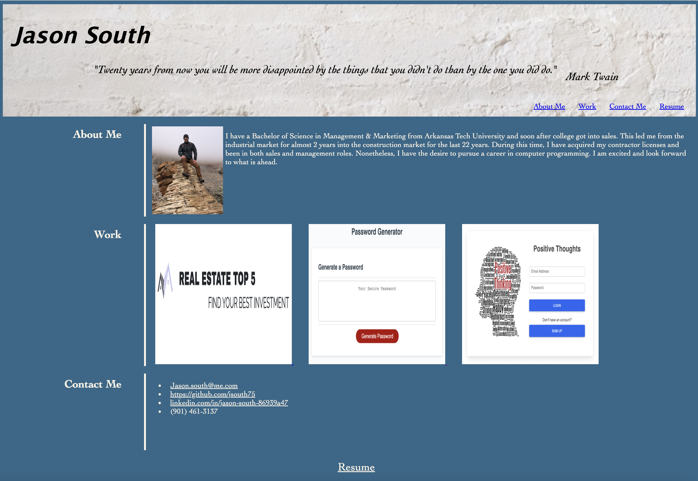

# First-portfolio

## Description

I first created a html file and a css file.  Then built my html file with a header, navigation tags, div tags for the sidebar display that the navigation tags take you to.  Other content, pictures, and links were then added. 
I used css to style the page with font, background colors, and aligning contents accordingly.  Also, I used media queries to create a responsive web site.
I have not had much experience at this time, so I will be adding to this site at a later date. 

URL: https://jsouth75.github.io/first-portfolio/
GitHub link: https://github.com/jsouth75/first-portfolio

